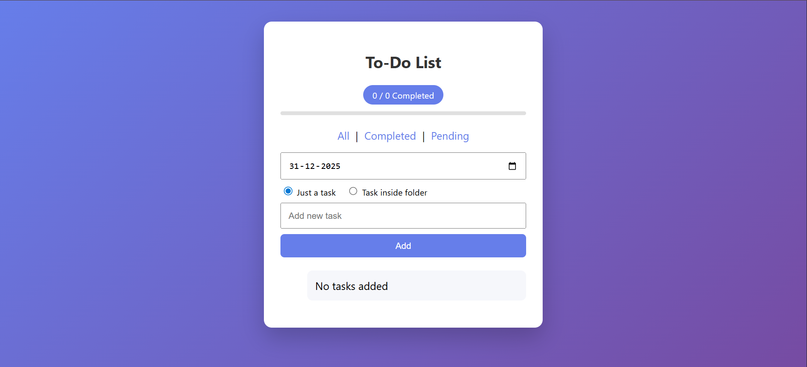
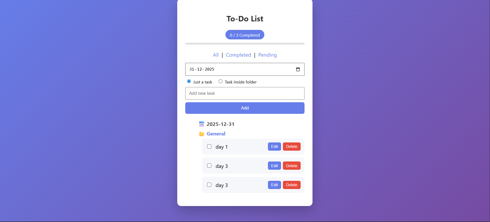
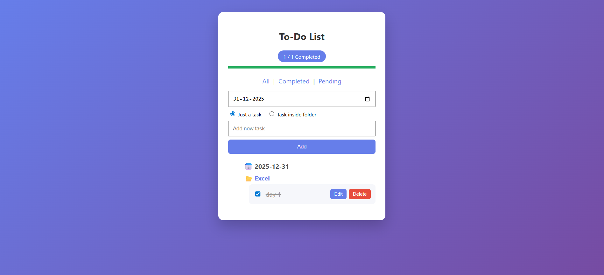

# 📝 To-Do List / Task Manager (Static Web App)

A modern **To-Do List / Task Manager** built using **HTML, CSS, and JavaScript** with **IndexedDB** for persistent storage.  
This project was originally designed using Django and later converted into a **fully static web application** so it can be deployed easily on **GitHub Pages** or **Vercel**.

---

## 🚀 Features

- ✅ Create tasks day-wise
- 📁 Create **folders inside a day** (DSA, Django, JS, etc.)
- 📝 Add multiple tasks inside a folder
- 📂 **Collapsible folders** (open / close to save screen space)
- ✏️ Edit tasks inline
- 🗑️ Delete individual tasks
- ✔️ Mark tasks as completed
- 📊 Progress bar showing completed vs total tasks
- 🔍 Filter tasks:
  - All
  - Completed
  - Pending
- 💾 Persistent storage using **IndexedDB**
- 🌐 Fully **static** (no backend required)

---

## 🛠️ Tech Stack

- **HTML5**
- **CSS3**
- **Vanilla JavaScript**
- **IndexedDB** (Browser Database)

---

## 📂 Project Structure

```
To-Do-List/
│
├── index.html
├── favicon.png
├── js/
│   ├── app.js
│   └── db.js
└── README.md
```


📖 How It Works

Tasks are stored in IndexedDB, so data is saved even after page refresh or browser restart.

Data hierarchy:
```
Day
 └── Folder
      └── Tasks
```

Folders are created automatically when you add a task inside a folder.

Folders are collapsed by default and expand on click.

🌍 Live Demo

```
👉 Live Site: https://manidharsaggam.github.io/To-Do-List/
```
## 📸 Screenshots

### Main Dashboard


### Folder-Open


### taask-progress


### Folder View


### Folder Viewdit


```


🧪 How to Run Locally

Clone the repository
```
git clone https://github.com/Manidharsaggam/To-Do-List.git
```

Open the project folder
```
cd To-Do-List
```

Run the app

```
Open index.html in your browser

(Recommended: use VS Code Live Server)
```
👨‍💻 Author

Manidhar Saggam
GitHub: @Manidharsaggam

⭐ Support

If you like this project, give it a star ⭐ on GitHub!


